<div align="center">

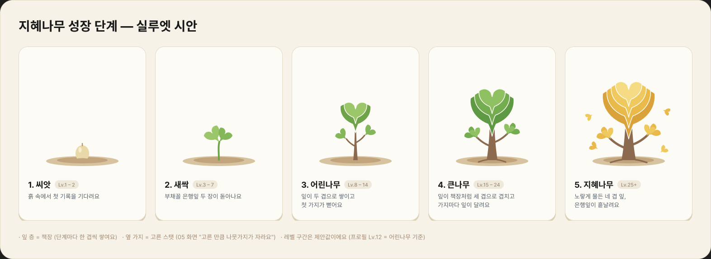

# 🌱 Profile

### 말하면 자라는 성장 캐릭터

**오늘 한 일을 한 줄 적으면, AI가 읽고, 내 나무가 자란다.**

<br/>


</div>

<br/>

## 💡 Why Profile?

자기계발 기록은 늘 같은 곳에서 무너집니다.

- 📋 **기록이 귀찮다.** 카테고리 고르고, 시간 입력하고, 체크하고… 사흘이면 지칩니다.
- 📉 **성장이 안 보인다.** 오늘 공부 1시간이 내 인생에 무슨 의미인지 체감되지 않습니다.
- 🫥 **혼자라서 쉽게 놓는다.** 아무도 안 보는 기록은 끝까지 가기 어렵습니다.

**Profile은 이 셋을 한 번에 뒤집습니다.**

> 그냥 말하듯 적으세요. 분석은 AI가, 성장은 나무가 보여줍니다.

<br/>

## ✨ How it works

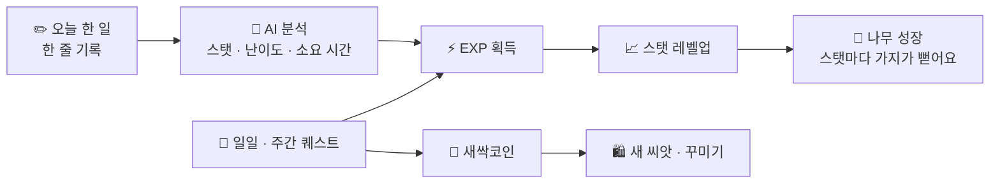

```text
"오늘 리액트로 로그인 기능 구현함"
        ↓  AI 분석
스탯  🧠 리액트 (지식)
난이도 ■■■ 어려움
시간  90분
        ↓
+180 EXP   리액트 Lv.8  62% → 79%
```

<br/>

## 📱 Screens

<div align="center">

| 홈 | 기록 | AI 분석 결과 |
|:---:|:---:|:---:|
| 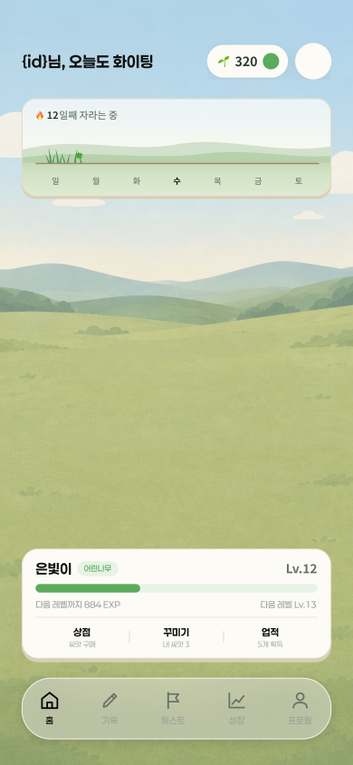 | 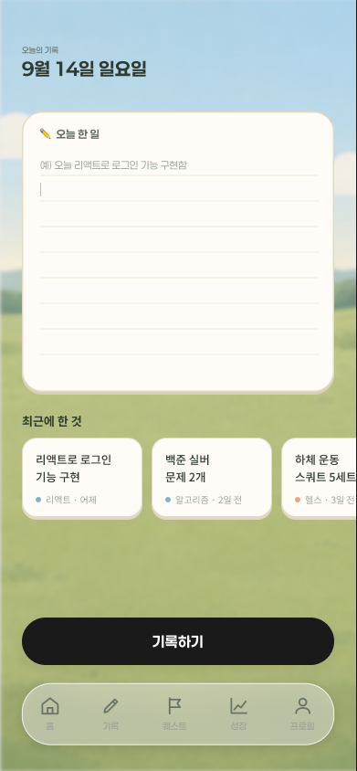 | 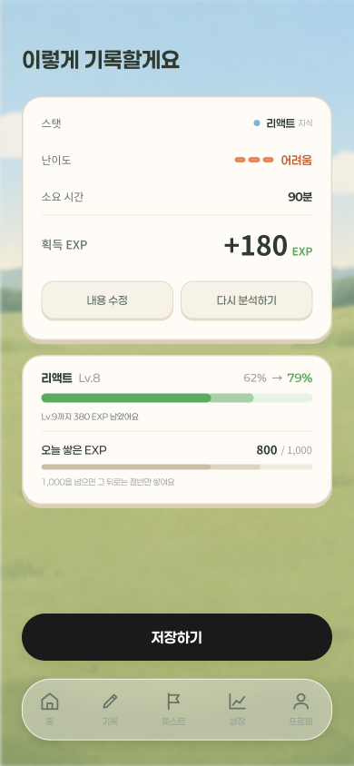 |
| **매일 자라는 내 나무** | **말하듯 한 줄 기록** | **AI가 EXP로 변환** |

| 성장 리포트 | 퀘스트 | 프로필 |
|:---:|:---:|:---:|
| 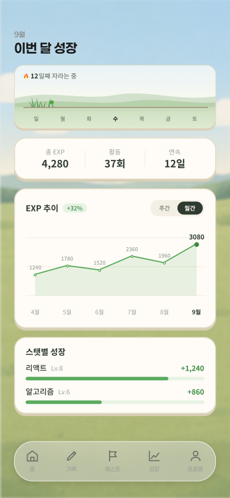 | 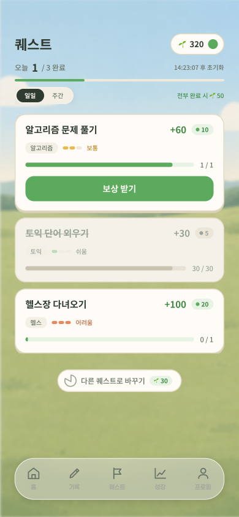 | 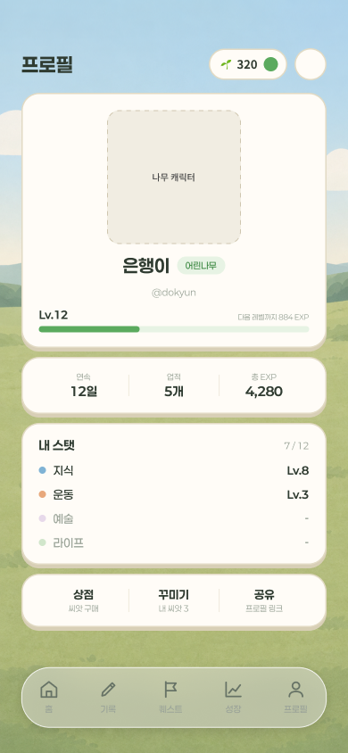 |
| **월별 EXP 추이 · 스탯별 성장** | **일일 · 주간 퀘스트** | **연속 기록 · 업적 · 스탯** |

</div>

<br/>

## 🧩 Core Features

### ✏️ 자연어 기록 → AI 분석
폼도, 드롭다운도 없습니다. 오늘 한 일을 그냥 적으면 AI가 **어떤 스탯인지, 얼마나 어려웠는지, 얼마나 걸렸는지** 읽어내 EXP로 바꿔줍니다. 결과가 마음에 안 들면 바로 수정하거나 다시 분석할 수 있어요.

### 🌳 성장 캐릭터, 나무
레벨이 오를수록 나무가 자랍니다. **고른 스탯만큼 나뭇가지가 뻗어서**, 나무 모양만 봐도 내가 어떤 사람으로 크고 있는지 보입니다.

| 단계 | 🌰 씨앗 | 🌱 새싹 | 🌿 어린나무 | 🌳 큰나무 | ✨ 지혜나무 |
|:---:|:---:|:---:|:---:|:---:|:---:|
| 모습 | 흙 속의 씨앗 | 부채꼴 잎 두 장 | 잎 두 겹 + 첫 가지 | 잎 세 겹, 책장처럼 | 황금빛 네 겹 |

### 🌰 씨앗 시스템
처음 고르는 씨앗이 나의 첫 성장 방향이 됩니다. 고른 분야는 **Lv.5까지 EXP ×1.3** 보너스를 받아요.

| 씨앗 | 나무 | 분야 | 특징 |
|---|---|---|---|
| 지혜나무 씨앗 | 은행나무 | 🧠 지식 | 잎이 책장처럼 겹겹이 자라요 |
| 가시선인장 씨앗 | 소나무 | 💪 운동 | 거칠고 단단하게 자라요 |
| 🔒 벚나무 · 느티나무 · 자작나무 | | | 새싹코인으로 해금 |

### 🧠 스탯 시스템
**지식 · 운동 · 예술 · 라이프** 4개 카테고리 아래에서 내가 키우고 싶은 스탯(알고리즘, 리액트, 토익, 헬스, 러닝…)을 직접 고릅니다. 카테고리당 최대 3개, 원하는 스탯은 직접 추가할 수도 있어요.

### 🎯 퀘스트 & 새싹코인
매일 · 매주 새로 열리는 퀘스트를 깨면 EXP와 **🌱 새싹코인**을 받습니다. 마음에 안 드는 퀘스트는 코인을 내고 바꿀 수 있고, 모두 깨면 보너스가 있어요. 모은 코인으로 새 씨앗을 사거나 나무를 꾸밀 수 있습니다.

### ⚖️ 지속 가능한 성장 설계
하루 **1,000 EXP**를 넘으면 그 뒤로는 절반만 쌓입니다. 하루에 몰아서 하기보다 **매일 조금씩** 하는 게 이득이 되도록 설계했어요. 연속 기록일은 홈에서 바로 보입니다.

<br/>

## 🚀 Onboarding

<div align="center">

| 1. 로그인 | 2–3. 프로필 · 관심 분야 | 4. 첫 씨앗 | 5. 스탯 설정 |
|:---:|:---:|:---:|:---:|
| 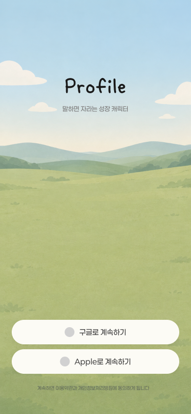 | 닉네임 · 사진 →<br/>지식 · 운동 · 예술 · 라이프 | 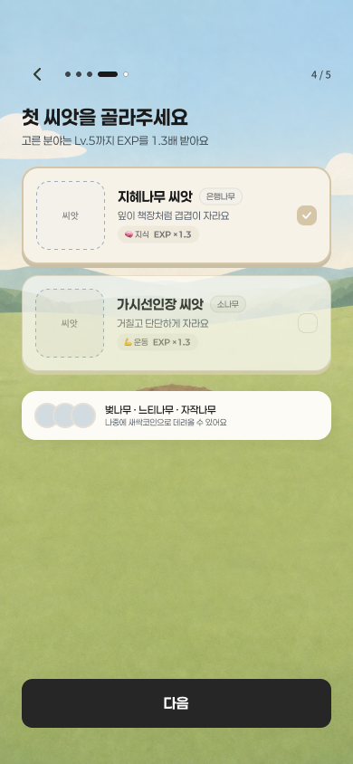 | 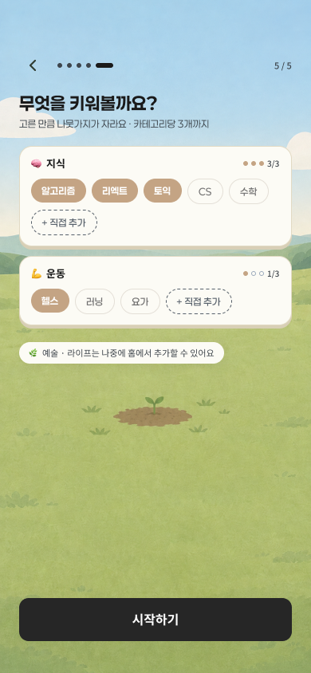 |
| Google · Apple 소셜 로그인 | 여러 개 선택 가능 | 고른 분야 EXP ×1.3 | 카테고리당 3개까지 |

</div>

<br/>

## 🗺️ Roadmap

- [x] 서비스 기획 · 성장 루프 설계
- [x] UI/UX 디자인 (온보딩 · 홈 · 기록 · AI 분석 · 성장 · 퀘스트 · 프로필)
- [x] 지혜나무 성장 단계 시안
- [ ] 나무 캐릭터 일러스트 (5단계 × 씨앗별)
- [ ] AI 활동 분석 파이프라인
- [ ] 앱 구현
- [ ] 상점 · 꾸미기 · 프로필 공유

<!--
## 🛠️ Tech Stack
TODO: 스택 확정 후 추가
-->

<br/>

<div align="center">

**🌱 오늘 한 줄이 내일의 나무가 됩니다.**

</div>
